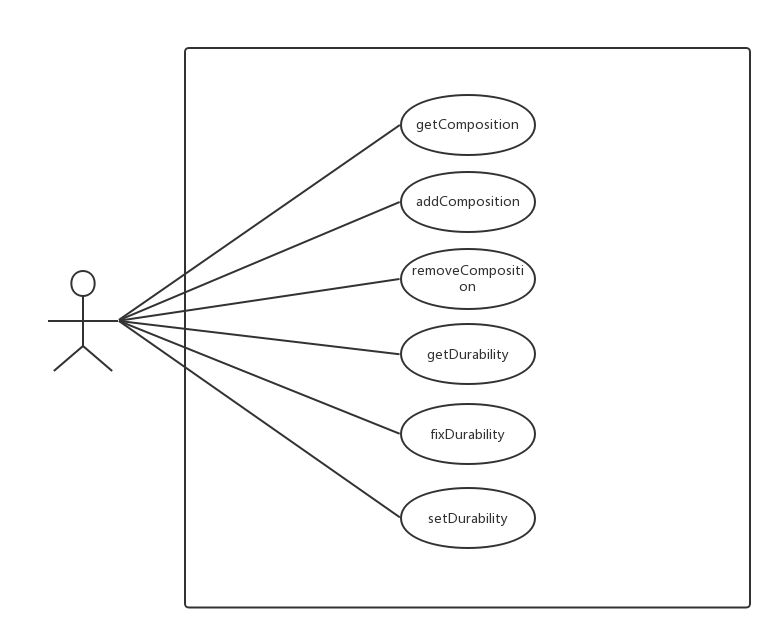

# DPCourseDesign
2017.10. Tongji University Course "Design Patterns" final project 

##File Hierachy
>**diagraphs**
>>usecase_tool *Issane* *20171014* *-*
>**documents**
>**images**

##Class Diagram

##Usecase Diagrams
1.tool

### README.md file update log
2017/10/14 Add a sample of one Design Pattern 'Portotype'
2017/10/16 Add a usecase diagram of 'tool' class
