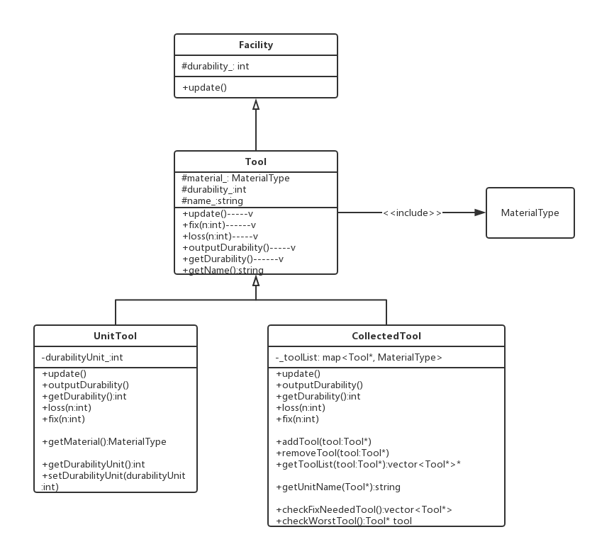

# DPCourseDesign
2017.10. Tongji University Course "Design Patterns" final project 

# Class Diagram
1.tool

# Usecase Diagrams
1.tool

# README.md file update log
2017/10/14 Add a sample of one Design Pattern 'Portotype'
2017/10/16 Add a usecase diagram of 'tool' class
